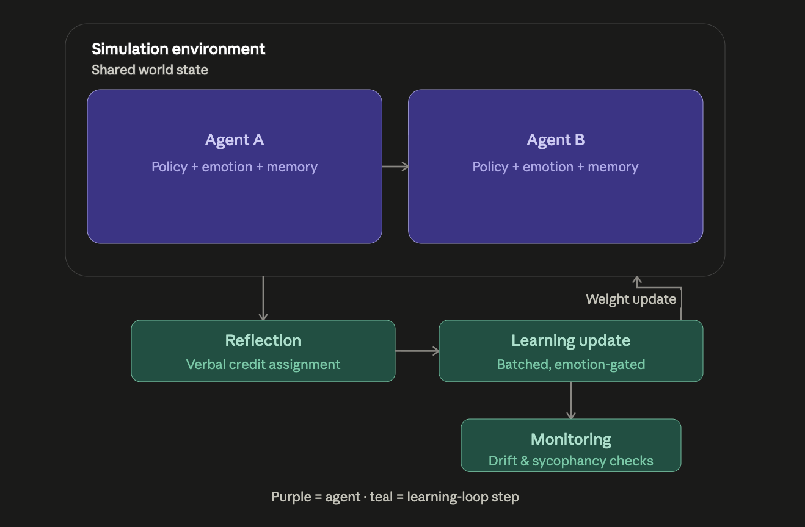

# marvarium

studying how emotional introspection and multi-agent social interactions in LLMs with unfrozen weights in a simulated environment can induce/enhance learning. heavily inspired and motivated by the emotion machine by marvin minsky

- attachment-based learning + pain-based learning as a credit-assignment problem --> Jaques, Natasha. Social Influence as Intrinsic Motivation for Multi-Agent Deep Reinforcement Learning. (2018)
- verbalized self reflection + self conscious reflection based decision making --> Lindsey, Jack. Emergent Introspective Awareness in Large Language Models. (2026)
- mania vs depression on/off toggle as a learning-signal gate --> Friston, Karl. The free-energy principle: a unified brain theory? (2010)
- self-models + personality code-switching --> Chen, Runjin, et. al. Persona Vectors: Monitoring and Controlling Character Traits in Language Models. (2025) 
- emotional experiences induced by visual stimuli --> Yang, Jingyuan, et al. EmoSet: A Large-Scale Visual Emotion Dataset with Rich Attributes. (2023)
  
the experimental platform will primarily be scaffolded in rust, with agent implemenations in python 

### references:

Minsky, Marvin. The Emotion Machine: Commonsense Thinking, Artificial Intelligence, and the Future of the Human Mind. (2006)

Park, Joon Sung, et al. Generative Agents: Interactive Simulacra of Human Behavior (2023)

Park, Joon Sung, et al. LLM Agents Grounded in Self-Reports Enable General-Purpose Simulation of Individuals (2024)
